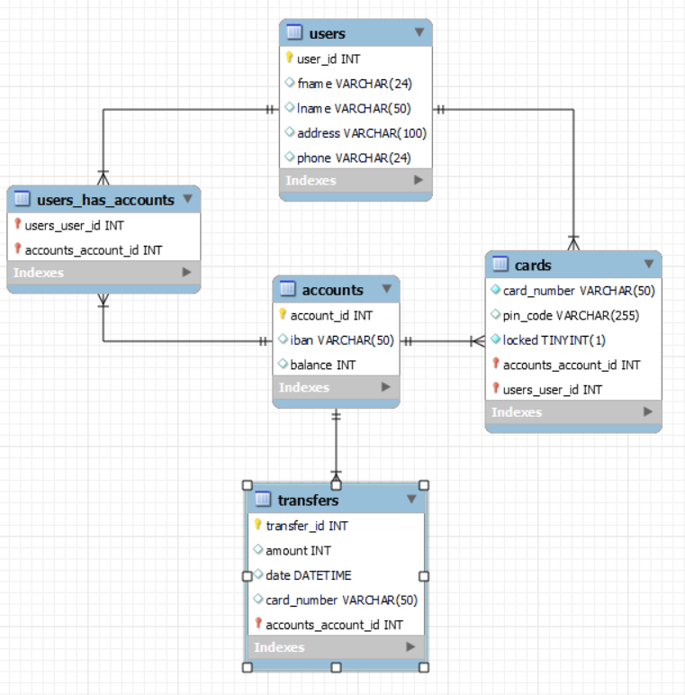

# GROUP 1 : Pankkiautomaattisovellus

QT-sovelluksen koodeista tarkemmin omassa [README.md](https://github.com/bank-2022/group1/tree/main/bankautomat#readme)-tiedostossaan

## Rajapinnan asennusohje
Aja api kansiossa komento npm install. Sitten sovellus käynnistyy komennolla npm start.

### .env
Luo api kansioon .env tiedosto ja luo sinne muuttuja AUT_TOKEN. Aja komentorivillä komento "node create_token" ja kopioi siitä tuleva merkkijono muuttujan AUT_TOKEN arvoksi.

Rajapinnasta lisää omassa [README.md](https://github.com/bank-2022/group1/tree/main/api#readme)-tiedostossa.

## Tietokanta
Tietokanta on hostattu ilmaispalvelulla https://www.freemysqlhosting.net/

### ER-kaavio
Tietokannan ER-kaavio näyttää tältä 
