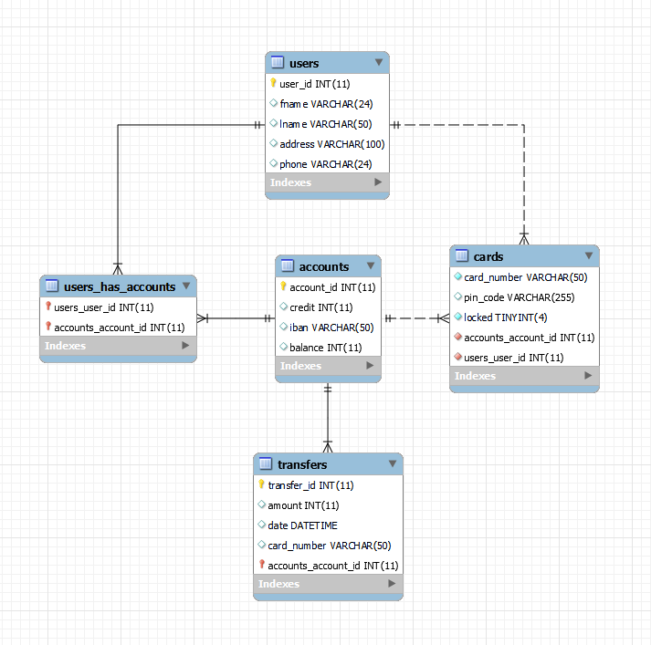
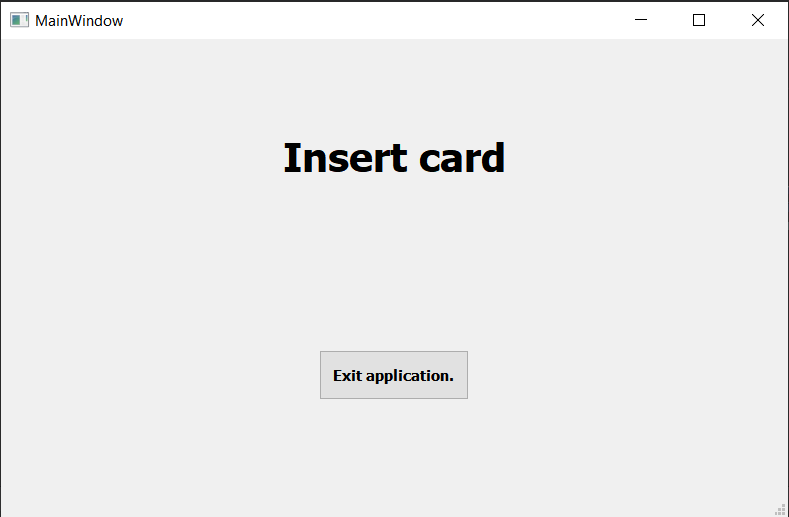
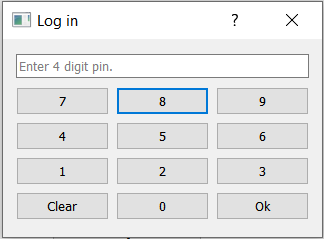
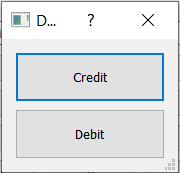
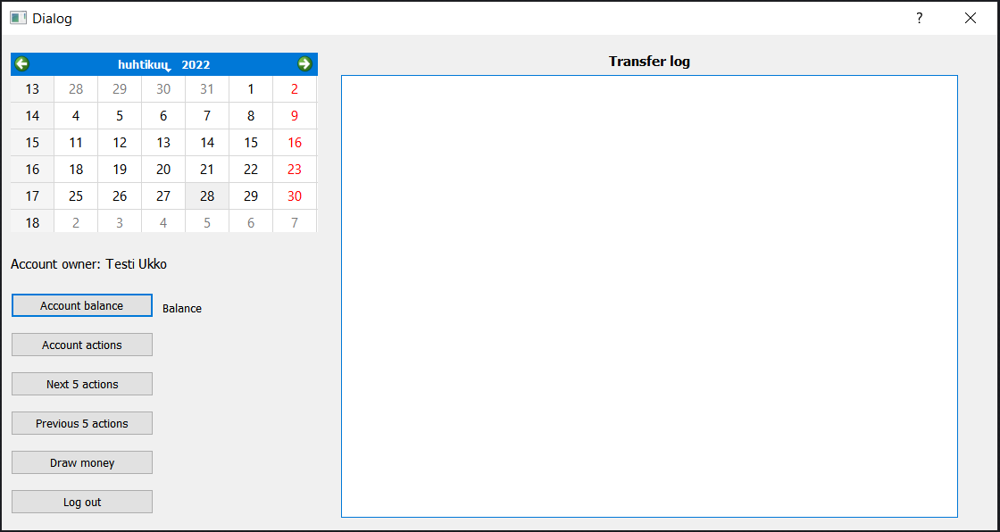
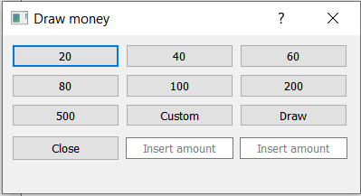

# GROUP 1 : Pankkiautomaattisovellus

## Asennusohje
Aja api kansiossa komento npm install. Sitten sovellus käynnistyy komennolla npm start.

### .env
Luo api kansioon .env tiedosto ja lisää sinne seuraavat muuttujat:

    HOST = "sql11.freemysqlhosting.net"
    USER = "sql11488057"
    PASSWORD = "YJX8tWcMYn"
    DATABASE = "sql11488057"
    AUT_TOKEN = ""  

Aja komentorivillä komento "node create_token" ja kopioi siitä tuleva merkkijono muuttujan AUT_TOKEN arvoksi.

### Tietokanta
Tietokantaa isännöi freemysqlhosting.net.

### REST-api
REST-apia isännöi heroku.com

## ER-kaavio
Tietokannan ER-kaavio näyttää tältä. 

## Ohjelman käyttöliittymät
Syötä kortti. 

Syötä pin. 

Valitse credit tai debit. 

Pääkäyttöliittymä. 

Nosta rahaa. 

